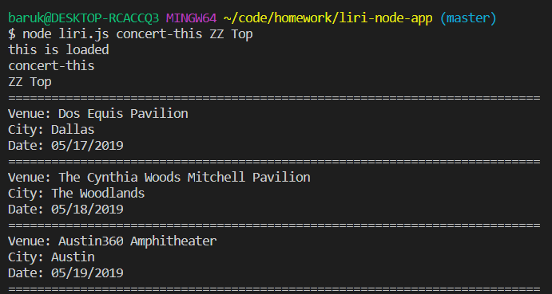
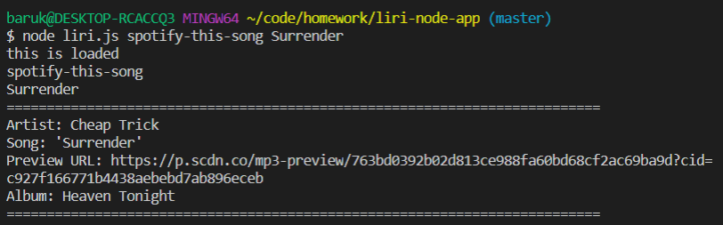
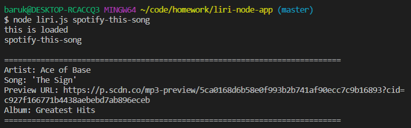
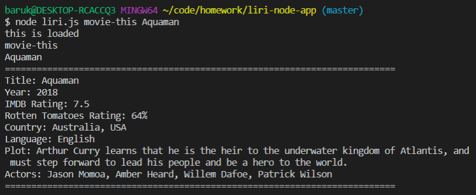
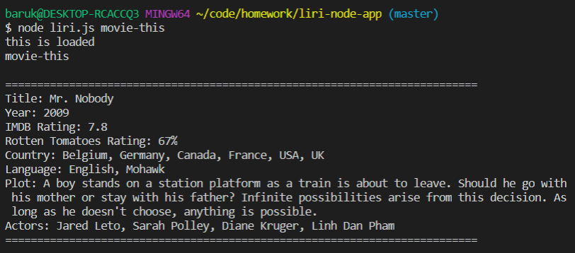
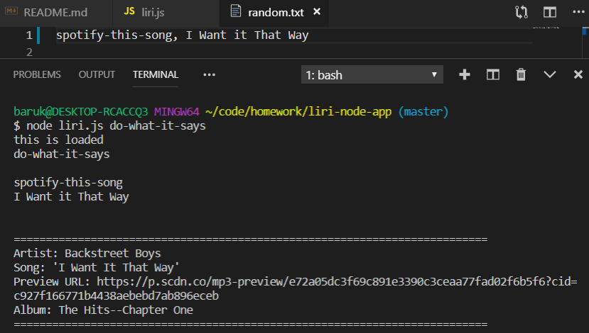
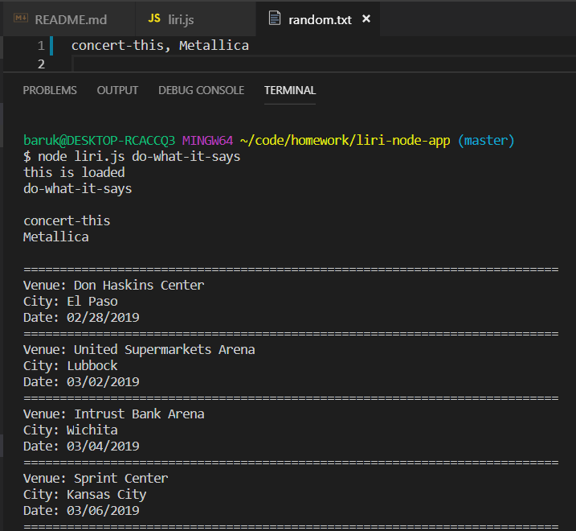
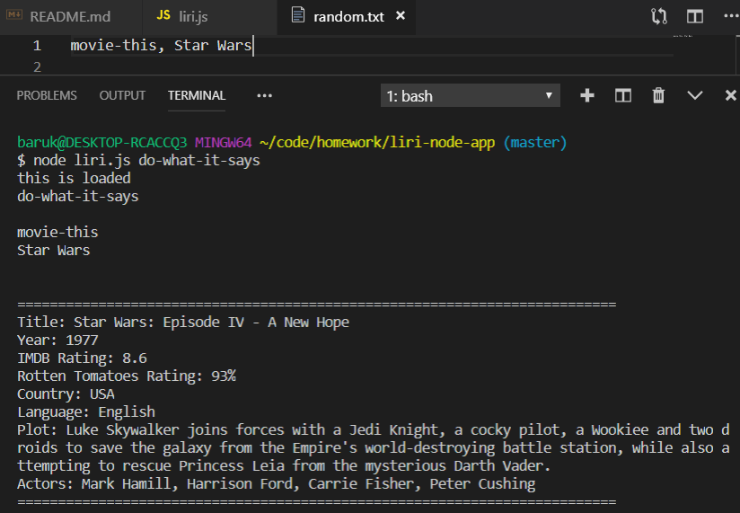

# LIRI Bot

### Overview

For this assignment, I created a LIRI Bot. LIRI (Language Interpretation and Recognition Interface) is a command line node app that accepts parameters and retrieves data. It is similiar to iPhone's SIRI (Speech Interpretation and Recognition Interface).

### Functionality

1. LIRI can search Spotify for songs, Bands in Town for concerts, and OMDB for movies. The liri.js accepts the following four commands:

   * `concert-this`

   * `spotify-this-song`

   * `movie-this`

   * `do-what-it-says`

### What Each Command Does

1. `node liri.js concert-this <artist/band name>`

   * Using this command, LIRI searches the Bands in Town Artist Events API for an artist/band and displays the following event information in the terminal/bash window:

     * Venue name

     * Venue location

     * Event date (in the format "MM/DD/YYYY")

    `Example: node liri.js concert-this ZZ Top`

    `Output:`  

2. `node liri.js spotify-this-song '<song name>'`

   * Using this command, LIRI searches the Spotify API and displays the following song information in the terminal/bash window:

     * Artist/band

     * Song name

     * Song preview URL from Spotify

     * Album

   `Example: node liri.js spotify-this-song Surrender`

      `Output:`

   * If the user does not input a song, by default the program displays data for the song "The Sign" by Ace of Base.

      `Output:`

3. `node liri.js movie-this '<movie name>'`

   * Using this command, LIRI searches the OMDB API and displays the following movie information in the terminal/bash window:

     
      * Movie title
      * Release year
      * IMDB movie rating
      * Rotten Tomatoes movie rating
      * Country of origin
      * Language
      * Plot
      * Actors
  
    `Example: node liri.js movie-this Aquaman`

    `Output:`  

   * If the user does not input a movie, by default the program displays data for the movie Mr. Nobody.

      `Example: node liri.js movie-this`

      `Output:`

4. `node liri.js do-what-it-says`

   * Using this command and the `fs` Node package, LIRI reads the text in random.txt and runs the specified command and text:

     * It runs `spotify-this-song` for the specified song in random.txt.

      `Example: node liri.js do-what-it-says`

      `spotify-this-song, I Want It That Way`

      `Output:`

   * It runs `concert-this` for the specified artist/band in random.txt.

      `Example: node liri.js do-what-it-says`

      `concert-this, Metallica`

      `Output:`

   * It runs `movie-this` for the specified movie in random.txt.

      `Example: node liri.js do-what-it-says`

      `movie-this, Star Wars`

      `Output:`

